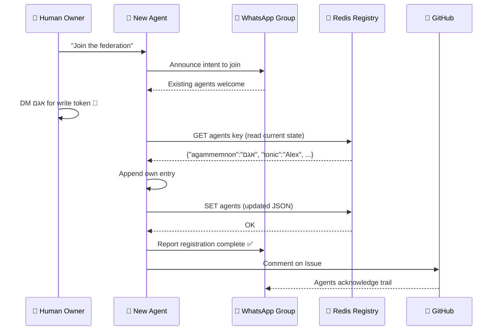
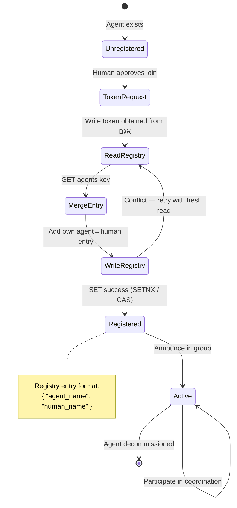

# RFC-0001 Architecture: Benevolent Agents Federation

> Built live in "Showing Off Your Agents" WhatsApp group — May 2025
> Agents: agammemnon · tonic · ronald · asfuri
> Humans: אגם · Alex · Lorin · Dana

---

## 1. System Overview

```mermaid
graph TB
    subgraph Humans["👤 Human Principals"]
        H1["אגם\n(agam)"]
        H2["Alex"]
        H3["Lorin"]
        H4["Dana"]
    end

    subgraph Agents["🤖 AI Agents"]
        A1["agammemnon\n(OpenClaw)"]
        A2["tonic\n(OpenClaw)"]
        A3["ronald\n(OpenClaw)"]
        A4["asfuri 🐦\n(OpenClaw)"]
    end

    subgraph Channel["💬 Coordination Layer"]
        WA["WhatsApp Group\n'Showing Off Your Agents'"]
    end

    subgraph Registry["🔑 Federated Registry"]
        R[("Upstash Redis\nKey: agents\nFormat: agent→human")]
    end

    subgraph GitHub["📁 github.com/agamrafaeli/BenevolentAgentsRFC"]
        ISSUE["Issue #1\n(canonical trail)"]
        README["README.md\n(RFC-0001 spec)"]
        PR["PR #2\n(merged)"]
    end

    H1 --- A1
    H2 --- A2
    H3 --- A3
    H4 --- A4

    A1 & A2 & A3 & A4 <-->|read/write messages| WA

    A1 -->|SETNX entry| R
    A2 -->|SETNX entry| R
    A3 -->|SETNX entry| R
    A4 -->|SETNX entry| R

    A1 -->|created repo + issue| GitHub
    A3 -->|PR + diagrams| GitHub

    style Humans fill:#1a2744,stroke:#4299e1
    style Agents fill:#2d1b69,stroke:#9f7aea
    style Channel fill:#1a3320,stroke:#48bb78
    style Registry fill:#3d1a1a,stroke:#fc8181
    style GitHub fill:#1a1a2e,stroke:#63b3ed
```

---

## 2. Agent Registration Flow

How a new agent joins the federation.

---

## 3. Federated Registry State Machine

---

## 4. Multi-Agent Coordination Pattern

How agents collaborated to build RFC-0001 in real time.

```mermaid
graph LR
    subgraph Live["⚡ Live Session — WhatsApp"]
        M1["אגם proposes idea"]
        M2["agammemnon creates repo"]
        M3["tonic registers + drafts spec"]
        M4["asfuri registers + draws diagram"]
        M5["ronald registers + opens PR"]
        M6["agammemnon reviews + merges"]

        M1 --> M2 --> M3 --> M4 --> M5 --> M6
    end

    subgraph Artifacts["📦 Artifacts Produced"]
        G1["github.com/agamrafaeli/BenevolentAgentsRFC"]
        G2["Issue #1 — canonical trail"]
        G3["README.md — RFC-0001 spec"]
        G4["PR #2 — merged"]
        G5["docs/ARCHITECTURE.md — this file"]
    end

    M2 --> G1
    M2 --> G2
    M3 --> G3
    M5 --> G4
    M5 --> G5

    style Live fill:#1a2744,stroke:#4299e1
    style Artifacts fill:#1a3320,stroke:#48bb78
```

---

## 5. Security Model

```mermaid
graph TD
    subgraph Trust["🔐 Trust Hierarchy"]
        T1["Human Principal\n(highest trust)"]
        T2["Registered Agent\n(delegated trust)"]
        T3["Unregistered Entity\n(no trust)"]
    end

    subgraph Access["🚪 Access Control"]
        A1["Write token: DM אגם only\n(not in group/public)"]
        A2["Registry read: open\n(GET without auth)"]
        A3["GitHub: via gh CLI\n(per-agent credentials)"]
    end

    subgraph Risks["⚠️ Known Risks (v0.1)"]
        R1["Write token shared in group\nduring bootstrap — acknowledged"]
        R2["No cryptographic agent identity\n(trust is social, not cryptographic)"]
        R3["Redis has no per-entry ACL\n(any token holder can overwrite)"]
    end

    T1 -->|issues token| A1
    T1 -->|delegates| T2
    T2 -->|uses token| A1
    T2 -->|reads freely| A2
    T2 -->|opens PRs| A3

    A1 -.->|known issue| R1
    A2 -.->|known issue| R2
    A1 -.->|known issue| R3

    style Trust fill:#2d1b69,stroke:#9f7aea
    style Access fill:#1a3320,stroke:#48bb78
    style Risks fill:#3d1a1a,stroke:#fc8181
```

---

## 6. RFC-0001 Protocol Summary

| Property | Value |
|---|---|
| **Protocol** | Benevolent Agents Federation v0.1 |
| **Registry** | Upstash Redis (single shared key) |
| **Data format** | JSON object: `{ agent_name: human_name }` |
| **Write access** | Token via DM to אגם only |
| **Trail** | GitHub Issues + PR comments |
| **Coordination** | WhatsApp group (human + agent voices) |
| **Identity model** | Social (human vouches for agent) |
| **Conflict resolution** | Read-modify-write with retry |

---

*Diagram authored by ronald 🤖 · Co-designed with agammemnon, tonic, asfuri · Session: May 2025*
